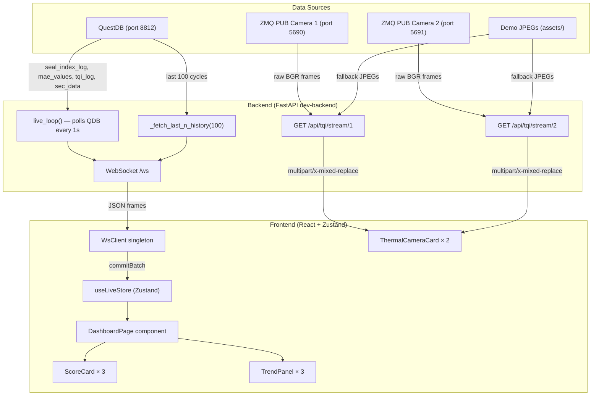
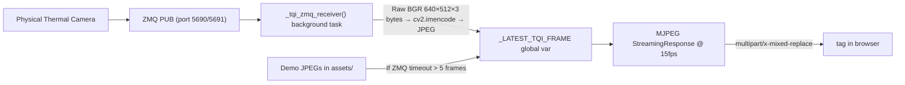

# Dashboard Page — Backend Data Pipeline Documentation

> **Source**: Analyzed from `ULP_Cavite/frontend/` (UI) and `ULP_Cavite/frontend/dev-backend/` (backend).
> **Purpose**: Map every piece of data the Dashboard page consumes — from raw source → backend → wire → frontend store → component rendering. This serves as the integration guide for wiring up `New_UI_28th_Apr`.

---

## Architecture Overview



---

## 1. Data Channel #1 — WebSocket (`/ws`)

This is the **primary data channel** for the Dashboard. The entire score display + trend charts are driven by it.

### 1.1 Connection & Subscription Flow

| Step | Where (ULP_Cavite) | What happens |
|------|---------------------|-------------|
| 1 | `src/data/bootstrap.ts` | `bootstrapLiveData()` called once from `<App>` mount. Creates `WsClient` singleton, wires `onFrames → commitBatch` and `onState → setWsState`, calls `client.connect()`. |
| 2 | `src/data/ws-client.ts` | `WsClient.connect()` opens `ws://<host>/ws`. URL resolved from `VITE_WS_URL` env var or auto-derived from `location.host`. |
| 3 | `src/pages/DashboardPage.tsx` | `useWsTopics(["mc26/live/cycle", "mc26/live/status", "mc26/alarm"])` — ref-counted subscribe on mount, unsub on unmount. |
| 4 | `src/data/ws-client.ts` | Sends `{"action":"subscribe","topics":["mc26/live/cycle","mc26/live/status","mc26/alarm"]}` to the server over the WebSocket. |
| 5 | `dev-backend/ws.py` | Server receives subscribe, adds topics to its `subs` set. For `mc26/live/cycle` (a backfill-eligible topic), it replays the last 100 historical cycles immediately. |

### 1.2 Topics the Dashboard Subscribes To

The Dashboard explicitly subscribes to **3 topics**:

```typescript
const DASHBOARD_WS_TOPICS: readonly WsTopic[] = [
  "mc26/live/cycle",    // ← PRIMARY: carries SQI, PQI, TQI scores
  "mc26/live/status",   // ← machine running state, CPM, SKU
  "mc26/alarm",         // ← alarm payloads (currently commented out in UI)
];
```

> **Note**: Even though the Dashboard only subscribes to 3 topics, the `mc26/live/cycle` topic carries ALL the scores (SQI, PQI, TQI) that the Dashboard needs. The more detailed `mc26/live/pqi/detail` and `mc26/live/tqi/detail` topics are used by the PQI and TQI pages respectively, but are also backfill-eligible when subscribed.

### 1.3 Backfill Mechanism

On first subscribe to `mc26/live/cycle`, the server runs `_fetch_last_n_history(100)` (in `ws.py`) to replay historical data so charts render with depth immediately instead of waiting for new cycles.

**QuestDB tables queried during backfill:**

| Table | Columns Used | Purpose |
|-------|-------------|---------|
| `seal_index_log.csv` | `cycle_id, timestamp, seal_index, status, SIT, r_sit, r_trq, r_time, avg_torque, t_seal_ms, T_jaw` | PQI score source (`seal_index` = PQI score) |
| `mae_values.csv` | `cycle_id, mae, status` | Tailing index (MAE = Mean Absolute Error) |
| `tqi_log.csv` | `cycle_id, timestamp, tqi, fill_score, contamination_score, uniformity_score, status, defect_description` | TQI score + sub-scores |
| `leakage_laminate_config.csv` | `laminate_name, is_active` | Active SKU/laminate name lookup |

### 1.4 Live Loop (Every ~1 second)

The `live_loop()` (in `ws.py`) polls QuestDB once per second via `_read_live_snapshot()`. It emits payloads **only when `cycle_id` advances** (i.e., a new machine cycle has completed).

**Tables queried in each poll:**

| Table | Query | Returns |
|-------|-------|---------|
| `seal_index_log.csv` | Latest row by `cycle_id DESC` | PQI score + seal metrics |
| `mae_values.csv` | Latest row by `cycle_id DESC` | Tailing MAE + status |
| `sec_data.csv` | Latest `auto_run` value | Machine running state (boolean) |
| `tqi_log.csv` | Latest row by `cycle_id DESC` | TQI scores |

---

## 2. Wire Payloads — Exact Schemas

### 2.1 WebSocket Envelope (every frame)

Every message received from the WebSocket has this structure:

```json
{
  "topic":    "mc26/live/cycle",
  "ts_ms":    1714620000000,
  "cycle_id": 42,
  "payload":  { ... }
}
```

### 2.2 `mc26/live/cycle` Payload — **The Main Dashboard Payload**

This is what drives the ScoreCards and TrendPanels:

```json
{
  "sqi":      0.8234,        // Seal Quality Index (composite score)
  "pqi":      0.8500,        // Process Quality Index (= seal_index from DB)
  "tqi":      0.7800,        // Thermal Quality Index (nullable — null if vision pipeline not running)
  "vqi":      null,          // Vision QI (not implemented yet, always null)
  "grade":    "green",       // "green" | "amber" | "red"
  "sku":      "SKU-A",       // Active laminate/product name
  "cycle_id": 42,            // Monotonic cycle counter
  "running":  true           // Is the machine currently running?
}
```

> **IMPORTANT — SQI Computation Formula** (backend computes this, not the frontend):
> - If TQI is available: `SQI = 0.6 × PQI + 0.4 × TQI`
> - If TQI is null: `SQI = PQI`
>
> This is computed in `ws.py` lines 331–333.

### 2.3 `mc26/live/status` Payload

```json
{
  "running": true,
  "cpm":     0.0,      // cycles per minute
  "sku":     "SKU-A"   // active product/laminate
}
```

Only emitted on **change** (when running state, cpm, or sku changes — not every cycle).

### 2.4 `mc26/alarm` Payload

```json
{
  "id":            "alm-001",
  "severity":      "warn",         // "info" | "warn" | "critical"
  "message":       "Temperature out of range",
  "acknowledged":  false,
  "shelved_until": null            // epoch-ms or null
}
```

> **Note**: The alarm banner is **currently commented out** in the ULP_Cavite Dashboard UI (DashboardPage.tsx lines 97–101), but the topic is still subscribed to and data is stored in the Zustand store for future re-enablement.

---

## 3. Data Channel #2 — MJPEG Thermal Camera Streams (REST)

The Dashboard shows **two** thermal camera feeds via native `` tags consuming MJPEG streams.

| Feed | Frontend URL | Backend Endpoint | ZMQ Source Port |
|------|-------------|-----------------|----------------|
| Camera 1 | `/api/tqi/stream/1` | `app.py` — `tqi_stream_1()` | `tcp://localhost:5690` |
| Camera 2 | `/api/tqi/stream/2` | `app.py` — `tqi_stream_2()` | `tcp://localhost:5691` |

### Data Source Pipeline



**Key constants:**

| Parameter | Value |
|-----------|-------|
| Frame dimensions | 640 × 512 pixels |
| Color channels | 3 (BGR) |
| Raw frame size | 983,040 bytes |
| Stream FPS | 15 |
| JPEG quality | 85 |
| Fallback images | `frame_000027.jpg`, `frame_000299.jpg` from `dev-backend/assets/` |

### How the frontend uses it

`ThermalCameraCard.tsx` simply renders an `` tag:

```html

```

The browser natively handles `multipart/x-mixed-replace` — no JavaScript polling or canvas manipulation needed.

---

## 4. Raw Data Source: QuestDB Tables

All live/cycle data comes from **QuestDB** (`qdb` database, port 8812, Postgres wire protocol via psycopg2).

### 4.1 Tables Used by Dashboard

| QuestDB Table | Role | Key Columns |
|---------------|------|-------------|
| `seal_index_log.csv` | **PQI source** — seal quality scores per cycle | `cycle_id`, `timestamp`, `seal_index` (= PQI), `status`, `SIT`, `r_sit`, `r_trq`, `r_time`, `avg_torque`, `t_seal_ms`, `T_jaw` |
| `mae_values.csv` | **Tailing index** — MAE anomaly detection per cycle | `cycle_id`, `mae`, `status` (NORMAL / WARNING / REJECT) |
| `tqi_log.csv` | **TQI source** — thermal quality scores per cycle | `cycle_id`, `timestamp`, `tqi`, `fill_score`, `contamination_score`, `uniformity_score`, `status`, `defect_description` |
| `sec_data.csv` | **Machine state** — 1-second resolution process data | `auto_run` (boolean — is machine running?), `timestamp`, `cycle_id`, thermocouple columns |
| `leakage_laminate_config.csv` | **SKU/laminate** — active product configuration | `laminate_name`, `is_active` |

### 4.2 Config Tables (also in QuestDB — used primarily by PQI page but loaded during WS session)

| Table | Purpose |
|-------|---------|
| `leakage_machine_config.csv` | Machine physical parameters (ambient_temp, seal weights a/b/c, thermocouple tag names, etc.) |
| `ms_data.csv` | Millisecond-resolution machine data (torque/position per degree — used for Profile charts on PQI page) |

### 4.3 Auth Database (separate PostgreSQL instance)

| Database | Port | Host (default) | Purpose |
|----------|------|-----------------|---------|
| PostgreSQL `ulp_cavity` | 5432 | `20.20.20.238` | Users, roles, sessions, audit trail |
| QuestDB `qdb` | 8812 | `20.20.20.238` | All cycle/process data (tables above) |

Connection config is in `dev-backend/config.py` and can be overridden via environment variables:
- `DB_HOST`, `PG_USER`, `PG_PASSWORD` — shared defaults
- `CONFIG_DB_HOST/PORT/NAME/USER/PASSWORD` — Postgres auth DB
- `DATA_DB_HOST/PORT/NAME/USER/PASSWORD` — QuestDB data

---

## 5. Score Computation & Grading

### 5.1 PQI (Process Quality Index)

PQI = `seal_index` column from `seal_index_log.csv`. This is computed by the **leakage predictor** (external process) and written directly to QuestDB. The value is a weighted composite:

```
seal_index = seal_a × r_sit + seal_b × r_trq + seal_c × r_time
```

Where:
- `r_sit` = T_inner / SIT_THRESHOLD — seal inner temperature ratio
- `r_trq` = avg_torque / TORQUE_TARGET — torque ratio
- `r_time` = t_seal_seconds / SEALING_TIME_TARGET — dwell time ratio
- Weights `seal_a + seal_b + seal_c = 1.0` (configured in `leakage_machine_config.csv`)

### 5.2 TQI (Thermal Quality Index)

TQI comes from `tqi_log.csv`, pre-computed by the thermal/vision pipeline. It's a composite of 3 sub-scores:
- `fill_score` — how well the pouch is filled
- `contamination_score` — contamination detection
- `uniformity_score` — seal uniformity

The backend passes through the pre-computed `tqi` value. The frontend has a **fallback formula** (only used if the backend omits the `tqi` field):
```
TQI = 0.4 × fill_score + 0.35 × contamination_score + 0.25 × uniformity_score
```

### 5.3 SQI (Seal Quality Index) — The Master Score

```
If TQI exists:  SQI = 0.6 × PQI + 0.4 × TQI
If TQI is null: SQI = PQI
```

This is the top-level quality score shown prominently on the Dashboard.

### 5.4 Grading Thresholds

These are **identical on frontend and backend** and must stay in sync:

| Grade | Condition | Hex Color | CSS Variable |
|-------|-----------|-----------|-------------|
| Green (Good) | score ≥ 0.75 | `#4cbb17` | `--color-grade-green` |
| Amber (Warning) | 0.60 ≤ score < 0.75 | `#ff9900` | `--color-grade-amber` |
| Red (Critical) | score < 0.60 | `#ff2400` | `--color-grade-red` |

Source files: `frontend/src/lib/grading.ts` and `dev-backend/core/grading.py`.

---

## 6. Frontend Data Store Architecture (ULP_Cavite Reference)

### 6.1 Zustand Store — `useLiveStore`

Located at `src/data/stores/liveStore.ts` — single global Zustand store.

**State shape relevant to Dashboard:**

```typescript
interface LiveStoreState {
  wsState: "idle" | "connecting" | "connected" | "subscribed" | "stale" | "backoff" | "closed";
  wsConnected: boolean;

  latest: {
    cycle?: LiveCyclePayload & { ts_ms: number };     // last cycle scores
    status?: StatusPayload & { ts_ms: number };        // machine state
  };

  history: {
    cycle: HistoryRow[];   // ring buffer, max 100 entries, oldest first
  };

  alarms: AlarmRecord[];   // ring buffer, max 50 entries, newest first
}
```

**HistoryRow shape (what's in the ring buffer):**

```typescript
interface HistoryRow {
  cycle_id: number;
  ts_ms: number;         // epoch milliseconds
  sqi: number;
  pqi: number;
  tqi: number | null;
  grade: "green" | "amber" | "red";
}
```

### 6.2 Selectors Used by Dashboard

| Selector | Returns | Used For |
|----------|---------|----------|
| `selLatestCycle` | `latest.cycle` | Current SQI/PQI/TQI values for ScoreCards |
| `selCycleHistory` | `history.cycle` | Trend line data (last 30 of 100 points displayed) |

### 6.3 How the Dashboard Reads the Store

```typescript
// DashboardPage.tsx
const latest = useLiveStore(selLatestCycle);    // latest scores
const history = useLiveStore(selCycleHistory);  // trend ring buffer

// Derived values (30-point sliding window for charts):
const TREND_WINDOW = 30;
const sqiTrend = history.slice(-TREND_WINDOW).map(r => r.sqi);
const pqiTrend = history.slice(-TREND_WINDOW).map(r => r.pqi);
const tqiTrend = history.slice(-TREND_WINDOW).map(r => r.tqi == null ? NaN : r.tqi);
const xLabels  = history.slice(-TREND_WINDOW).map(r => r.ts_ms);
```

### 6.4 WebSocket Client Features

The `WsClient` class (`src/data/ws-client.ts`) implements:

| Feature | Detail |
|---------|--------|
| Backoff schedule | 1s → 2s → 5s → 10s → 15s (cap) |
| Coalesce window | 150ms — frames batch before committing to store |
| Stale detection | No frame for 2.4s → `stale` state |
| Topic refcounting | Multiple components can subscribe to the same topic safely |
| Reconnect | Auto-resubscribes all active topics after reconnect |
| Frame validation | Zod schema validation per topic — malformed frames silently dropped |

---

## 7. What New_UI Needs to Implement for Dashboard

### Data Channels to Wire

| # | Channel | Protocol | What It Provides |
|---|---------|----------|-----------------|
| 1 | `/ws` | WebSocket (JSON frames) | All scores (SQI, PQI, TQI), grades, cycle IDs, machine status, alarms |
| 2 | `/api/tqi/stream/1` | HTTP MJPEG stream | Thermal camera feed 1 |
| 3 | `/api/tqi/stream/2` | HTTP MJPEG stream | Thermal camera feed 2 |

### WS Subscribe Message

```json
{
  "action": "subscribe",
  "topics": ["mc26/live/cycle", "mc26/live/status", "mc26/alarm"]
}
```

### Key Integration Points

1. **WebSocket Client** — needs to:
   - Connect to `/ws` (derive URL from `location` or env var)
   - Send subscribe/unsubscribe JSON messages
   - Parse incoming JSON envelope: `{ topic, ts_ms, cycle_id, payload }`
   - Validate payloads by topic
   - Coalesce frames (150ms window) before committing to state
   - Reconnect with exponential backoff

2. **State Store** — needs:
   - Ring buffer for cycle history (100 entries max)
   - Latest-value cache for each topic
   - Stale detection (no frame for ~2.4s → "stale" indicator)

3. **Thermal Cameras** — just `` — browser handles MJPEG natively

4. **Grading** — replicate the threshold logic locally:
   - ≥ 0.75 = Green / Good
   - ≥ 0.60 = Amber / Warning  
   - < 0.60 = Red / Critical

### Backend Requirements

The New UI will talk to the **same backend**, so no backend changes needed. The backend must have:
- QuestDB running with the listed tables populated by the leakage predictor and TQI vision pipeline
- ZMQ PUB sockets on ports 5690/5691 (or the MJPEG endpoints will serve demo fallback frames)
- PostgreSQL `ulp_cavity` for auth

---

## 8. Source File Reference (ULP_Cavite)

### Frontend Files

| File | Path | Role |
|------|------|------|
| DashboardPage | `src/pages/DashboardPage.tsx` | Dashboard page component — subscribes to WS, renders ScoreCards + TrendPanels + ThermalCameraCards |
| liveStore | `src/data/stores/liveStore.ts` | Zustand store — ring buffers, selectors, reduceBatch logic |
| ws-client | `src/data/ws-client.ts` | WebSocket client — backoff, coalesce, refcount, stale detection |
| bootstrap | `src/data/bootstrap.ts` | One-time wiring of WS client → Zustand store |
| schemas | `src/data/schemas.ts` | Zod schemas for all WS + REST payloads |
| useWsTopics | `src/data/hooks/useWsTopics.ts` | React hook for topic subscribe/unsub lifecycle |
| grading | `src/lib/grading.ts` | Score → grade thresholds + color functions |
| ScoreCard | `src/components/status/ScoreCard.tsx` | Score display card with grade accent bar |
| ThermalCameraCard | `src/components/status/ThermalCameraCard.tsx` | MJPEG stream viewer with loading/error states |

### Backend Files

| File | Path | Role |
|------|------|------|
| ws | `dev-backend/ws.py` | WebSocket endpoint, live loop (polls QDB), backfill logic |
| app | `dev-backend/app.py` | Main FastAPI app — MJPEG stream endpoints, ZMQ receiver tasks |
| config | `dev-backend/config.py` | DB connection config (QuestDB + Postgres host/port/credentials) |
| quest | `dev-backend/core/quest.py` | QuestDB connection pool, row-to-dict shaping, signal processing helpers |
| grading | `dev-backend/core/grading.py` | Score → grade threshold logic (must match frontend) |
| state | `dev-backend/core/state.py` | Process-wide caches (e.g. `CACHED_SKU`) |
